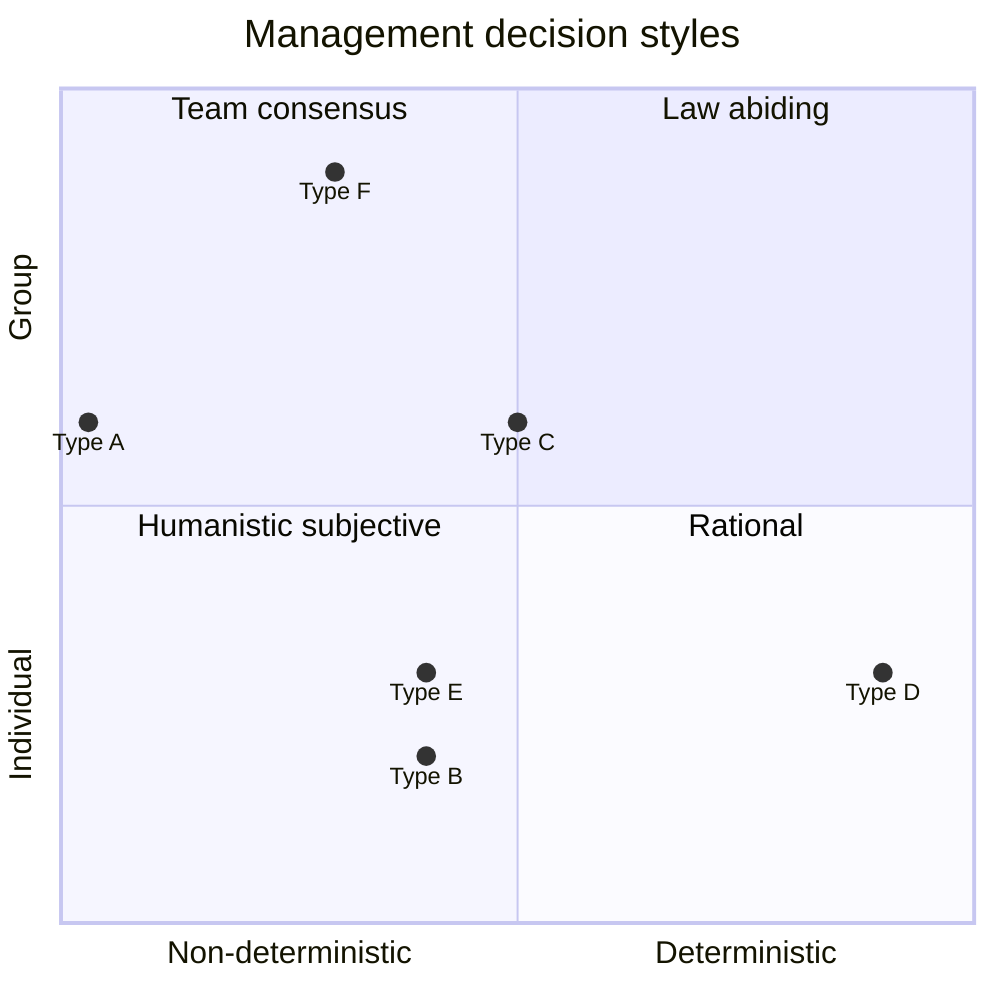

# Algorithmic management in knowledge-intensive firms

## Research problem

"I need somebody with a human touch" (Spice Girls, 1997)

Algorithms have played an important part in everyday life for millenniums, for example, the world's oldest known recipe is four thousand years old (Barjamovic et al., 2019). Algorithm as a concept was formalized by Al-Khwarizmi in the 9th century (Encyclopaedia Britannica, 2025). With the introduction of Scientific Management by Fredric Taylor in 1910, labor tasks became rationalized with analogue algorithms. With the introduction of computers in the mid 20th century, algorithms became digitalized. During World War II, with the introduction of Management Science and Operations Research, algorithms became specialized for management tasks.

In the last decades, with the growth of network infrastructure and increase in compute resources, algorithms have become more present in organizations. With research in data structures and algorithms, they are starting to assist in almost all management tasks that are traditionally performed by humans, such as increasing self-awareness, get feedback, set goals, set priorities, coaching, empowerment, delegation, motivation, conflict resolution, selling, strategy making, marketing, support, project-planning, monitoring, recruitment, retention, training, mentoring, ethics, and morality. If this evolution continues without research, reflection, and constructive criticism, it can lead to the scenario that we get managers without the human touch.

Milanez et al. (2025) did a survey of algorithmic management in the workplace, and highlights the need for additional research to ensure trustworthy use of it. They suggest five focus areas for further research. First, there is a need to understand the mechanisms by which algorithmic management tools improve managerial decision-making. Second, what impact does algorithmic management have on followers. Third, how does each type of algorithmic management tool influence outcomes and trustworthiness. Fourth, how do the outcomes vary with time since adoption. Fifth, what are the governance measures to consider.

Although management is primarily a functional process, it does serve a social process. As such, management cannot be entirely outsourced to computer-mediated technology, yet neither can it remain completely outside of algorithmic development. Management decisions can be categorized as deterministic or non-deterministic, and based on individualistic or community preferences, with a whole spectrum of possible positions between the extremes:

Similar to the problem of social cost (Coase, 2013), the problem of management cost is also about social arrangements. Coase (2013) advocates considering the total effect when analyzing social arrangements. Similarly, in creating and choosing between management arrangements we should have regard for the total effect. Avoid suboptimization and use an opportunity cost approach.

Although keystrokes might be excessive and against GDPR, it is still used in some countries. The question is, what is excessive and what is not?

From private conversations over the years, it is clear that not all software engineers want to become managers. Modig (2023) did a well-attended presentation about the desire of staying as a developer in your entire career. Given there is a need for the management role, and not everyone wants to pursue it, to which extend can it be automated with algorithms?

## State of the art

At the European level, there is a shortage of research which examines the pervasiveness and impacts on
working conditions, of digital monitoring and surveillance in the regular and platform economies (Macias et al., 2023).

Macias et al. (2023) identified two main types currently in use: algorithmic direction and algorithmic evaluation.

## Questions/hypotheses

"And all that I can see is just another lemon tree" (Fool's Garden)

The central question to analyze is how to get benefits from algorithmic management, without making people just see "another lemon tree", that is, how to keep them motivated and challenged.

* what is the role of leadership in this context
* how is leader-follower relationship affected by optimization of match quality
* how much emotions are needed
* How can algorithms encourage managers to reward sound decision making, instead of only rewarding results?
* What are the implications of being in the different positions in the quadrants? The focus is not on finding an optimal position, but the implications of being in the different positions.
* How can algorithms help minimize the computational cost of interacting with each other?
* Which tasks and responsibilities should be automated, and which tasks and responsibilities should belong to humans?

Different perspectives to look at this problem:

* As a change management issue
* Compare with history how similar changes were received

* How is trust and authority built, maintained or eroded with algorithmic management
* How does algorithmic management affect emotions and efficiency on the long-term and short-term
* What are the signaling costs when using algorithmic management
* Group efficiency: Optimal number of people in software development teams in terms of economic productivity
* Which performance-based incentives are relevant for engineers
* What is the optimal team size with respect to experience and career goals
* What is the role of managers, if everyone is skilled enough
* How does the different mood states of an individual affect team efficiency, for example positive versus negative moods
* How does stress affect team performance
* Trust-based management versus monitoring
* How to use DEA to measure software development output
* Learning curve application for onboarding new software developers (how introduction material and onboarding will help developer quickly get up to speed compared to getting nothing at all, who needs intro, how much, how to deliver it to lowest cost, etc.)
* Develop pool of organizational successors - tool to help evaluate the extent of the organisations' pending shortage, needed competencies, identify individuals for possible inclusion in pool, establish individually tailored development programs for high-potential candidates, select and place people into senior jobs based on their performance, continuously monitor the program
* EI assessment - performance management tool for assessing if colleagues understand their emotional reactions, and how well they think you understand them. Ask people from another culture or someone with disability. Ask internal or external customers how well you appear to understand their position. Size up a coworker or manager as best as you can. Record your observations and test them against how that person performs or behaves many months later.
* How to make sure topics such as UX design patterns are continuously reinforced for all members without repeating or duplicating teaching
* The culture of continuous learning in contemporary society may also lead to a fear of not learning enough, I have talked to many members who are unsure about their future although I can clearly see they are continuously learning
* How to retain members - is it inherent to the equilibria of the retention model that they will stay a short time
* Enormous pressure you have to use the latest technologies, seldom reflect on what is actually needed, focus becomes more on technology than business value
* There is a value in unlearning as well

## Research design

* Data driven
    * Analyze efficiency over time
* Evaluate software development efficiency
    * Data Envelopment Analysis
        * Code commits
        * Issues resolved per sprint
        * Number of employees in team
    * Together with AHP/ANP
        * Team goal
        * Decide on criteria
        * Use criteria to evaluate task priority
* Model team organization as a continuous optimization problem of match quality
    * Business requirements and candidates continuously change
    * Members can rotate and leave at arbitrary times
    * Link it with DEA
* Interview people randomly in large numbers and ask them who they think the most efficient professionals are

## Theory/literature

* Barjamovic, G., Gonzalez, P. J., Graham, C. A., Lassen, A. W., Narsallah, N. and Sörensen, P. M. (2019) The Ancient Mesopotamian Tablet as Cookbook. Lapham’s Quarterly. `https://www.laphamsquarterly.org/roundtable/ancient-mesopotamian-tablet-cookbook`
* Bazerman, M. H. and Moore, D. A. (2017) Judgment in Managerial Decision Making. Wiley Custom.
* Coase, R. H. (2013). The Problem of Social Cost. The Journal of Law & Economics, 56(4), 837–877. `https://doi.org/10.1086/674872`
* Fernandez Macias, E., Urzi Brancati, M.C., Wright, S. and Pesole, A., The platformisation of work, EUR 31469 EN, Publications Office of the European Union, Luxembourg, 2023, ISBN 978-92-68-01661-9, doi:10.2760/801282, JRC133016.
* Milanez, A., A. Lemmens and C. Ruggiu (2025), "Algorithmic management in the workplace: New evidence from an OECD employer survey", OECD Artificial Intelligence Papers, No. 31, OECD Publishing, Paris, `https://doi.org/10.1787/287c13c4-en`
* Oredev Conference (2023). Tobias Modig - Get old, go slow, write code! [Video]. YouTube. `https://www.youtube.com/watch?v=Hb4M0EMyB6M`
* Spence, M. (1973). Job Market Signaling. The Quarterly Journal of Economics, 87(3), 355–374. `https://doi.org/10.2307/1882010`
* Spice Girls (1997). Stop [Song]. On Spiceworld [Album]. Virgin Records.
* The Editors of Encyclopaedia Britannica (2025). Al-Khwarizmi | Biography & Facts. Encyclopedia Britannica. `https://www.britannica.com/biography/al-Khwarizmi`

## Method

* Use opportunity cost approach for different algorithm situations

The PhD will use qualititative research methods to follow the development and application of algorithmic management in the tech sector in Sweden. The aim is to

* Triangulation on the same set of research questions
    * Data triangulation
    * Investigator triangulation
    * Theory triangulation
    * Methodological triangulation
* To avoid confirmation bias, it is important to be open to information that allows for disconfirmation
* Use analogical reasoning to reduce bias (Bazerman and Moore, 2017)
* Model beat plan as assignment problem to optimise resource use, while considering learning objectives
* If applied on organization level, workforce assignment with cross-training defined could optimize task assignment
* Investigate how small changes in behavior can drastically change the performance, such as saying good morning in a friendly voice
* Sort out causality by using instrumental variables regression - vacation times for example affect volume of work but not otherwise affect outcomes
