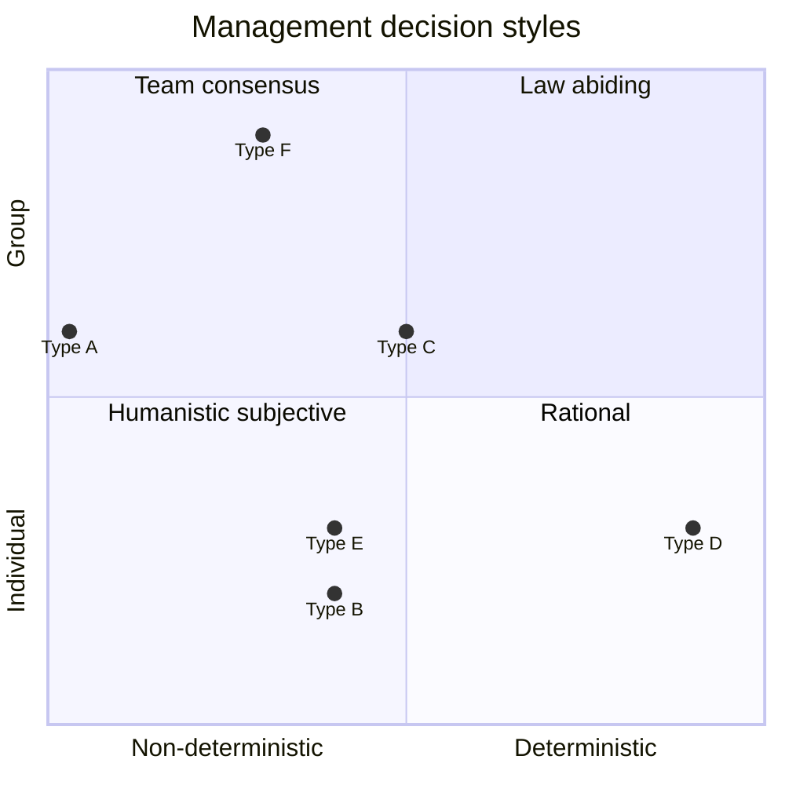

# Algorithmic management in knowledge-intensive firms

## Research problem

"I need somebody with a human touch" (Spice Girls, 1997)

Algorithms have played an important part in everyday life for millenniums, for example, the world's oldest known recipe is four thousand years old (Barjamovic et al., 2019). Algorithm as a concept was formalized by Al-Khwarizmi in the 9th century (Encyclopaedia Britannica, 2025). With the introduction of Scientific Management by Fredric Taylor in 1910, labor tasks became rationalized with analogue algorithms. With the introduction of computers in the mid 20th century, algorithms became digitalized. During World War II, with the introduction of Management Science and Operations Research, algorithms became specialized for management tasks.

In the last decades, with the growth of network infrastructure and increase in compute resources, algorithms have become more present in organizations. With research in data structures and algorithms, they are starting to assist in almost all management tasks that are traditionally performed by humans, such as increasing self-awareness, get feedback, set goals, set priorities, coaching, empowerment, delegation, motivation, conflict resolution, selling, strategy making, marketing, support, project-planning, monitoring, recruitment, retention, training, mentoring, ethics, and morality. If this evolution continues without research, reflection, and constructive criticism, it can lead to the scenario that we get managers without the human touch.

Although management is primarily a functional process, it does serve a social process. As such, management cannot be entirely outsourced to computer-mediated technology, yet neither can it remain completely outside of algorithmic development. Management decisions can be categorized as deterministic or non-deterministic, and based on individualistic or community preferences, with a whole spectrum of possible positions between the extremes:

Similar to the problem of social cost (Coase, 2013), the problem of management cost is also about social arrangements. Coase (2013) advocates considering the total effect when analyzing social arrangements. Similarly, in creating and choosing between management arrangements we should have regard for the total effect. Avoid suboptimization and use an opportunity cost approach.

## State of the art

Milanez et al. (2025) did a survey of algorithmic management in the workplace, and highlights the need for additional research to ensure trustworthy use of it. The authors suggest five focus areas for further research. First, there is a need to understand the mechanisms by which algorithmic management tools improve managerial decision-making. Second, what impact does algorithmic management have on individual contributors. Third, how does each type of algorithmic management tool influence outcomes and trustworthiness. Fourth, how do the outcomes vary with time since adoption. Fifth, what are the governance measures to consider.

Macias et al. (2023) identified two main types of algorithmic management currently in use: algorithmic direction and algorithmic evaluation. At the European level, there is a shortage of research which examines the pervasiveness and impacts on working conditions, of digital monitoring and surveillance in the regular and platform economies (Macias et al., 2023).

Ball (2021) evaluated literature on electronic monitoring and surveillance in the workplace, and recommends future research on topics related to algorithmic management:

* The development of high trust employee monitoring practices
* Technical and practical ways in which employees can gain autonomy over data collection and
sharing and the impact on performance and efficiency

From private conversations over the years, it is clear that not all software engineers want to become managers. Modig (2023) did a well-attended presentation about the desire of staying as a developer in your entire career. Given there is a need for the management role, and not everyone wants to pursue it, to which extend can it be automated with algorithms?

## Questions/hypotheses

"And all that I can see is just another lemon tree" (Fool's Garden)

The central question to analyze is how to benefit from algorithmic management in terms of total productivity, without making people just see another lemon tree, that is, without reducing their trust and motivation in the workplace.

Specifically, these questions are relevant for this project:

* How can algorithms encourage managers to reward sound decision making, instead of rewarding results? How can it encourage employees to focus on processes and not results?
* What are the implications of being in the different positions in the algorithmic management quadrants? The focus is not on finding an optimal position, but understanding the implications for leaders and contributors of being in the different positions.
    * Which management tasks and responsibilities should be deterministic, and which should be non-deterministic?
    * How do algorithms affect the human computational cost of interacting with each other? Do they simplify or make the social interaction between managers and individual contributors more problematic?
    * How is trust and authority built, maintained or eroded with algorithmic management
    * How does algorithmic management affect emotions and efficiency on the long-term and short-term
    * What are the signaling costs when using algorithmic management

Examples of algorithmic management:

* How can linear programming help to optimize task assignment on organizational level instead of on team level, with cross-training considered?
* For which types of management tasks will AHP be helpful in making decisions in software development?
* How much monitoring and assessment is needed to help in develop a pool of organizational successors?

Examples of non-deterministic behavior:

* How can small management behavior drastically improve the well-being of a stressed team, such as saying good morning to everyone in a friendly voice?
* Emotional intelligence test to assess if colleagues understand their emotional reactions, and how well they think their manager understand them
* Fear test to assess if colleagues are afraid of something such as missing out on knowledge, or uncomfortable with their own manager or a colleague or team

## Research design

Suggestions for different perspectives of analyzing this project:

* Understand which management tasks are necessary in knowledge-intensive organizations, and compare how they affect team performance when they are done with algorithms versus manually
* Algorithmic management is a change management initiative, so take inspiration from change management literature
* Compare how similar change initiatives over the history have been received by co-workers, this gives an outside perspective
* Use opportunity cost approach to analyze which tasks and behavior should be algorithmic

Use triangulation (Yin, 2003):

* Data triangulation
* Investigator triangulation
* Theory triangulation
* Methodological triangulation

Risks:

* How to avoid the Hawthorne Effect - subjects will be part of an experimental study, while at the same time doing their regular work
* To avoid confirmation bias, it is important to be open to information that allows for disconfirmation
* Use analogical reasoning to reduce bias (Bazerman and Moore, 2017)

## Method

The PhD-project will primarily use qualitative research methods to assess and compare the use of algorithmic management with non-deterministic management in the FinTech sector in Sweden. Qualitative methods are appropriate because the focus of the research is to understand the impact of algorithmic management on trust and motivation. Qualitative methods allows us to understand context and reasoning by focusing on the meaning, not the frequency (Ghauri et al., 2020).

Qualitative methods will align well with the day-to-day expectations of the management role. For example, qualitative interviews with individual contributors will overlap with regular mentoring talks.

Quantitative methods such as Data Envelopment Analysis (DEA) can be used to compare the efficiency between the experiment-groups.

## Theory/literature

* Ball, K. (2021). Electronic Monitoring and Surveillance in the Workplace, Publications Office of the European Union, Luxembourg, ISBN 978-92-76-43340-8.
* Barjamovic, G., Gonzalez, P. J., Graham, C. A., Lassen, A. W., Narsallah, N. and Sörensen, P. M. (2019). The Ancient Mesopotamian Tablet as Cookbook. Lapham’s Quarterly. `https://www.laphamsquarterly.org/roundtable/ancient-mesopotamian-tablet-cookbook`
* Bazerman, M. H. and Moore, D. A. (2017). Judgment in Managerial Decision Making. Wiley Custom.
* Coase, R. H. (2013). The Problem of Social Cost. The Journal of Law & Economics, 56(4), 837–877. `https://doi.org/10.1086/674872`
* Fernandez Macias, E., Urzi Brancati, M.C., Wright, S. and Pesole, A. (2023). The platformisation of work, EUR 31469 EN, Publications Office of the European Union, Luxembourg, ISBN 978-92-68-01661-9.
* Ghauri, P., Grønhaug, K. and Strange, R. (2020). Research Methods in Business Studies (5th ed.). Cambridge: Cambridge University Press.
* Milanez, A., A. Lemmens and C. Ruggiu (2025). "Algorithmic management in the workplace: New evidence from an OECD employer survey", OECD Artificial Intelligence Papers, No. 31, OECD Publishing, Paris, `https://doi.org/10.1787/287c13c4-en`
* Oredev Conference (2023). Get old, go slow, write code! [Video]. YouTube. `https://www.youtube.com/watch?v=Hb4M0EMyB6M`
* Spence, M. (1973). Job Market Signaling. The Quarterly Journal of Economics, 87(3), 355–374. `https://doi.org/10.2307/1882010`
* Spice Girls (1997). Stop [Song]. On Spiceworld [Album]. Virgin Records.
* The Editors of Encyclopaedia Britannica (2025). Al-Khwarizmi | Biography & Facts. Encyclopedia Britannica. `https://www.britannica.com/biography/al-Khwarizmi`
* Yin, R. K. (2003). Case Study Research: Design and Methods. SAGE.
